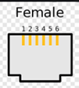

[Back to Readme](../README.md)

Here's the pin layout for the original Connector too.  

The GND and VCC are linked, purpose is likely to reduce cable resistance.  

| Pin | Wire Colour | Function |
|-----|-------------|----------|
| 1   | Blue        | VCC      |
| 2   | Yellow      | RS485    |
| 3   | Green       | RS485    |
| 4   | Red         | Ground   |
| 5   | Black       | VCC      |
| 6   | White       | Ground   |

Tested VCC to Ground Voltage: 5.4V 