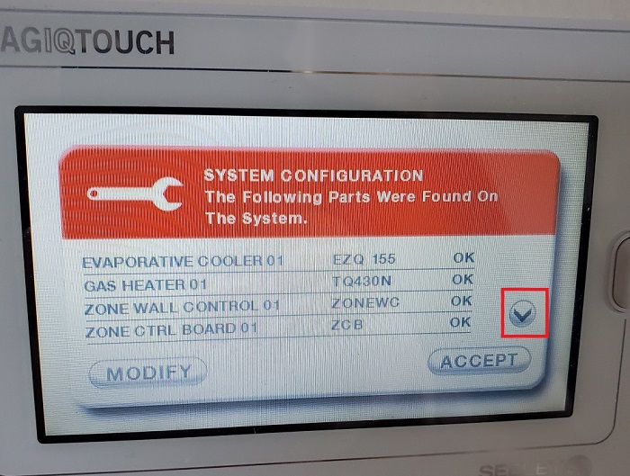

[Back to Readme](../README.md)

## New Module Setup.
These are the steps to add the module to your system.
If you use the official WiFi IOT module these steps are not required as it should already be configured for your system.
Swapping from the official module to this ESP Module does not require reconfiguration.

1. Go to Settings -> General -> System Configuration (Bottom of the list)
If you are prompted for a code, try **7378** (this is the code printed in my manual, if it doesnt work check your manual as it has the service code).

2. Display or Modify existing System.
   

3. Tap accept to start the system modbus scan.

4. It will scan for a couple minutes.

5. When complete should display a summary of components on the system.

6. The module should be detected as WiFi Smart Control, tap accept to complete the setup and the controller will restart.

7. Once the device startup is complete, it should be ready to go.
Note the WiFi status does not reflect the actual WiFi signal and uses a static code to fake the report.