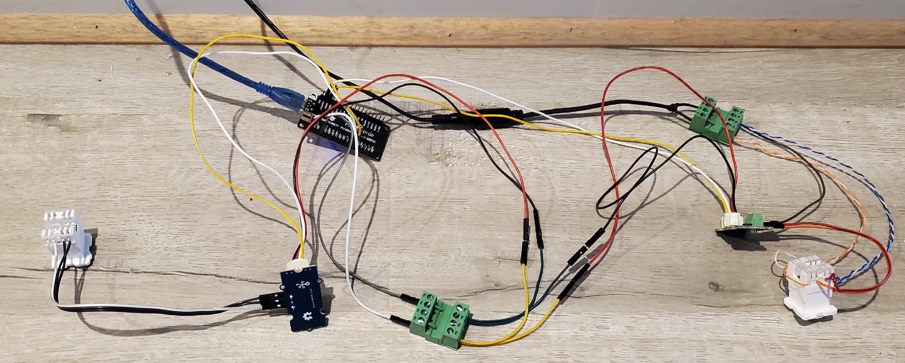

# MagIQTouch Modbus

This is a project to control Seeley MagIQTouch based HVAC System using an ESP32.
It replaces the official IOT/WiFi module for remote access and emulates the responses sent by the original unit.
The device will proxy modbus messages inbetween the primary control panel and other devices.
A web server is run on the ESP module for access and control.
Designed to be used as a basic API for other automation systems to control.

Working with configuration:
- Evaporative Cooler
- Gas Heater 
- 2 Zones
- 2 Wall Controllers.

Current Limitations:
- Refrigerated Cooling
- Zones 3 & 4 (Values are likely next in order from existing zone data)
- Untested support of systems that do not have the original IOT Module already configured with their MagiqTouch panel. (Response to module discovery process)
- Zone 1 Temp sensor is not always accurate, updates stop when system is off (Additional zones do not have this limitation).


Hardware List:
- FireBeetle ESP32 (DFRobot) - Any ESP32 that has 2x additional UART ports for the RS458 modules should work.
- 2x RS485 Modules (SeeedStudio - 103020193) - Available in AUS at Element14 as "Serial Communication Board, RS485"
- 2x RJ45 Connectors (Regular network jack)
- 2EDGRK Connectors (Optional)
- Ethernet Cable Wire (Solid Core)

Tools: 
- Krone Tool
- Wire Strippers
- Screw Driver

Connection list for the RS485 Modules to the ESP Module.
|ESP32 PIN|RS485 Module|
|-----------------|----------------|
|D0/IO16|Module 1 - TX|
|LRCK/IO17|Module 1 - RX|
|IO9/D5|Module 2 - TX|
|IO19/D6|Module 2 - RX|


Basic steps of this project:
- Purchase the required hardware.
- Download and Install Arduino IDE (Free).
- Update the INO code file under ArduinoControlLAN-AirconControl with your SSID/Passkey to connect to the WiFi network.
- Under Tools, Board manager install the package for your ESP32 device. FireBeetle works with "esp32 by Espressif Systems" - Version 2.0.17 Tested. v3 has serial issues with the Gen1 Firebeetle.
- Upload ArduinoControlLAN-AirconControl code to the ESP32 with the Arduino IDE.
- Check the serial output for the IP Address which will be printed at startup after WiFi connects, recommend reserving the address on your DHCP server.
- Connect RS485 Modules to the ESP32 as per above pinout list above.
- Disconnect the existing original WiFi IOT Module.
- Connect cables to the ESEP32-RS485 Modules (See connector info below for more detail).

ArduinoControlLAN-AirconMonitor code can also be used as a monitor of the modbus. (Useful for testing new configurations).


Connector Info:
The cables from the control panel and control board usea 6P6C male connector.
To avoid cutting the original cables, a standard 8P8C / RJ45 female jack can be used to connect to the individual wires.

The connector that goes to the control board only needs A,B and a single ground.
The connector to the wall control panel requires both GND and 5V connected as this powers the panel.
I have used a female DC barell cable to re-use the original 5V Power supply from the IOT/WiFi Module.

The pinout on the rear of an RJ45 jack can vary with A/B positions, the colours need to be matched for the correct wire position.
5V -> Solid Green and Solid Orange.
GND -> Brown/White and Blue/White.
RS485 A -> Orange/White.
RS485 B -> Solid Blue.


A messy arrangement of the devices ready to connect:




Here's the pin layout for the original Connector too.


The GND and VCC are linked, purpose is likely to reduce cable resistance.

| Pin | Wire Colour | Function |
|-----|-------------|----------|
| 1   | Blue        | VCC      |
| 2   | Yellow      | RS485    |
| 3   | Green       | RS485    |
| 4   | Red         | Ground   |
| 5   | Black       | VCC      |
| 6   | White       | Ground   |

Tested VCC to Ground Voltage: 5.4V 


Access and Control:

A GET Request to the module will return status info in JSON format.
Example of returned output.
```json
{
  "module_name": "ESP32-HVAC-Control",
  "system_power": 1,
  "system_mode": 2,
  "target_temp": 20,
  "target_temp_zone2": 11,
  "evap_mode": 37,
  "evap_fanspeed": 8,
  "heater_mode": 0,
  "heater_fanspeed": 0,
  "heater_therm_temp": 31,
  "heater_zone1_enabled": 1,
  "heater_zone2_enabled": 1,
  "zone1_temp_sensor": 27,
  "zone2_temp_sensor": 24,
  "panel_command_count": 458
}
```

Sending commands is simple using a POST request in plain/text to the path /command EG: http://192.168.20.112/command
The body should have a single command in the format setting=value

List of available commands, where x is the value.

| Command       | Available Values       | Purpose       |
|-----------------|----------------|----------------|
| power=x| on/off| System Power On or Off|
| zone1=x| on/off | Enable/Disable Zone 1 for Heater|
| zone2=x| on/off | Enable/Disable Zone 2 for Heater|
| fanspeed=x| 1-10 | Set Fan Speed for Fan, Cooler|
| mode=x| 0-4| Device Mode<br>0 = Fan Mode (External)<br>1 = Fan Mode (Recycle)<br>2 = Cooler (Manual)<br>3 = Cooler (Auto)<br>4 = Heater|
| temp=x| 0-28| Temperature Target for Cooler, Heater (Zone 1)
| temp2=x| 0-28| Temperature Target for Heater Zone 2|
| serial=x| on/off| Enables output of Modbus messages to Serial<br>Works with ModBusLogger tool on Serial message mode.|


MODBUS Information:
The Modbus Codes.xlsx file contains information about the modbus messages used on the network.
Messages are sent in pairs with a request and response message.
The document formats these by the Slave ID, Function Code, Request, Response with notes about the information found in these message pairs.

All devices are on the same single network, the primary / zone 1 control panel is the authorative device that sends the requests, all other devices respond.
Data that is requested from the control panel is typically sent with function 0x03 (read request) and information sent (write request) is with 0x10.

Known Slave IDs:
|Slave ID| Related Purpose|
|-----------------|----------------|
|0x01 | Unknown|
|0x02 | Evap Unit|
|0x8C (140)| Unknown|
|0x8D (141)| Heater Unit|
|0x97 (151)| Control Panel 2|
|0xA5 (165)| Unknown|
|0xD4 (212)| Zone Controller by elimination – may also be shared heater|
|0xEB (235)| IOT WiFi Module|
|0xF4 (244)| Unknown|
|0xFA (250)| Unknown|
|0xFE (254)| Unknown|
