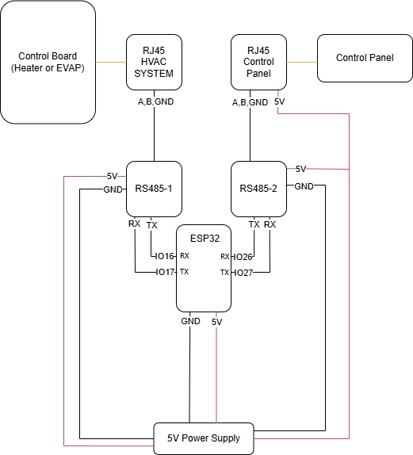
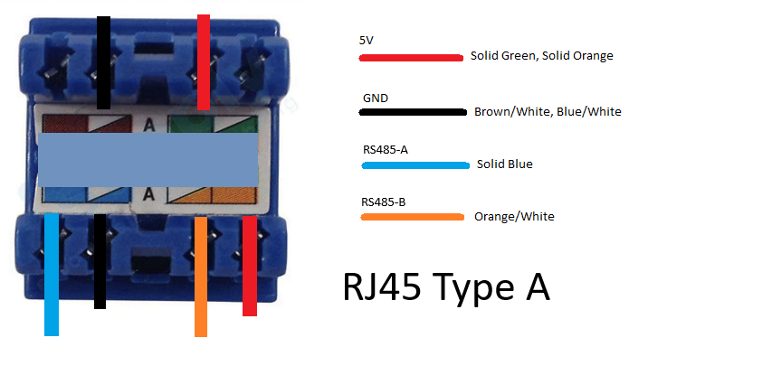

# MagIQTouch Modbus

This project is an alternative to the official WiFi Module for the MagiqTouch system.  
It provides local access and control with a simple [REST API](Docs/Api.md).

### Home Assistant Integration: 
[https://github.com/mrhteriyaki/magiqtouch-modbus-esp32-ha](https://github.com/mrhteriyaki/magiqtouch-modbus-esp32-ha)

### Tested Configuration and Limitations: [Link](Docs/Tested.md)

### Hardware List: [Link](Docs/HardwareList.md)

### API Documentation: [Link](Docs/Api.md)

### Configuration Steps:
1. Download and Install [Arduino IDE](https://www.arduino.cc/en/software/)
2. Download the contents of the folder [ArduinoControlLAN-AirconControl].
3. Open the file ArduinoControlLAN-AirconControl.ino the Arduino IDE should open.
4. Under Tools, Board manager install the package "esp32 by Espressif Systems" 
5. Select Tools > Port and select the port related to the ESP32 module.
6. Click the Upload button (Right pointing Arrow).
7. Once the upload is completed, restart the device to ensure it resets after the upload.
8. The device will then broadcast a local WiFi network named 'ESP32-AIRCON', connect to it with passkey 'ExtraTasty123!'
9. Browse to http://esp32-aircon.local/wifi (or http://192.168.4.1/wifi)  
10. Enter in your normal WiFi network name/password and click save.  
The device will then reboot and join the WiFi network with the provided details.  
(If you enter in the incorrect wifi details, you will need to re-flash with the 'erase all flash' option enabled to clear the saved settings.)
11. Confirm the device is accessible by browsing to http://esp32-aircon.local/  
A JSON formatted response is displayed similar to [this example](Docs/Api.md).  

Wiring diagram for the device:  
(Note Ethernet boards use alternate pins)  

### For ethernet boards:
IO5  / RX2 -> RS485 Module 1 TX  
IO17 / TX2 -> RS485 Module 1 RX  
IO14 -> RS485 Module 2 TX  
IO15 -> RS485 Module 2 RX  

## RS485 to RJ45 Connector Wiring
The cables from the control panel and control board use a 6P6C male connector so that would be ideal.  
However I did not have one available in testing so for this will use a regular 8P8C Wall jack.

| RS485 Module | RJ45 Wire (A Wiring) |
|--------------|-----------|
| 5V (Control Panel Port Only) | Solid Green and Solid Orange |
| GND | Brown/White and Blue/White. |
| RS485 A | Solid Blue |
| RS485 B | Orange/White |

The standard 8P8C / RJ45 female ethernet wall jack can be used to connect to the cables to the device.  
The connector to the system board only requires A,B serial wires and ground.  
The connector to the control panel requires A,B, GND and 5V to power the panel.  

The 5v power should also be connected to the 5V Pin on the ESP32, to power both RS485 modules and one RJ45 ports for the control panel.  
The pinout on the rear of an RJ45 jack can vary with A/B positions, so make sure to match up the colours not positions in the image below. 

Once you have wired up your device prepared, you should be able to connect it inbetween the heater unit control board and primary control panel.

If you are not replacing an existing WiFi module, you should be prompted when the module is detected to setup the WiFi settings, tap latter on this prompt.  
Try the the component configuration update if it does not show up in Settings -> Service.
[Instructions for detecting components](Docs/NewModule.md)

Here is my mess wired up inside a 3d printed housing, STL files for 3d printing available in the Housing-CAD-STL folder.  
(Image reflects older wiring with 9/10 pins, has been moved to use alternate pins since photo was taken.)  

Mounted inside the return air wallspace:  

## More Technical Notes:

### Control Panel Wiring / Pin Information: [Link](Docs/ControllerWiring.md)

### MODBUS Information [Link](Docs/Modbus.md)

