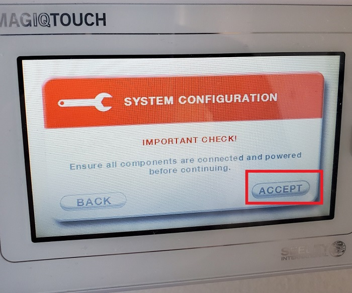
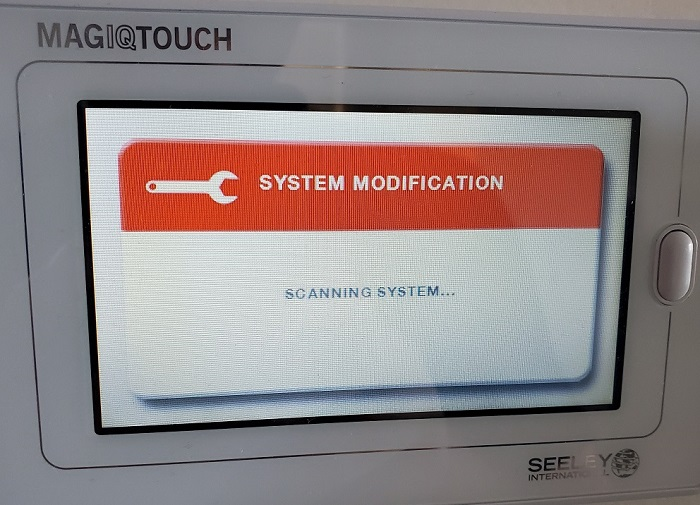
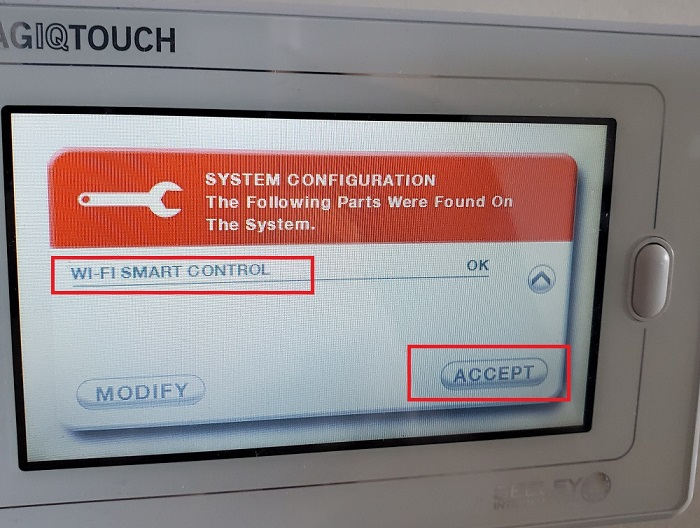

# MagIQTouch Modbus

This is a project to control Seeley MagIQTouch based HVAC System using an ESP32.  
Provides a basic REST API for monitoring and control.

### Home Assistant Integration:
https://github.com/mrhteriyaki/magiqtouch-modbus-esp32-ha


Working with system configuration:
- Evaporative Cooler
- Gas Heater
- 2 Zones and Wall Controllers.
- Fan Modes External and Recycle.  


Hardware List:
- FireBeetle ESP32 (DFRobot) - Any ESP32 with 2 UART ports should also work.
- 2x RS485 Modules (SeeedStudio - 103020193)  
Available in AUS at Element14 as "Serial Communication Board, RS485"
- 5V DC Power Supply

Cable / Connector List: 
- 2x RJ45 Connectors (Regular network jack, requires a 'punch down tool')
- Groove to Female Pin cables (SS110990028)
- 6P6C Cable if you are not replacing the original WiFi module.


Preparation Steps:
- Download and Install Arduino IDE (Free).
- Download the folder from this repository ArduinoControlLAN-AirconControl
- Under Tools, Board manager install the package "esp32 by Espressif Systems"  
**Use version 2.0.17 (v3 does not work correctly in testing).**

## Basic Setup Steps: 
- Set your WiFi Network name and password in the WiFiSettings.h file.
- Flash the ArduinoControlLAN-AirconControl.INO code to the ESP32 with the Arduino IDE.
- Check serial output for the IP address (Optional).
- Connect Modules as per diagram below.


## RS485 to RJ45 Wiring
| RS485 Module | RJ45 Wire (A Wiring) |
|--------------|-----------|
| 5V (Control Panel Port Only) | Solid Green and Solid Orange |
| GND | Brown/White and Blue/White. |
| RS485 A | Orange/White |
| RS485 B | Solid Blue |

The cables from the control panel and control board use a 6P6C male connector.  
A standard 8P8C / RJ45 female jack can be used to connect to the cables to the ESP Module.  
The connector to the system board only requires  A,B and ground.  
The connector to the control panel requires A,B, GND and 5V to power the panel.  

The 5v power should also be connected to the 5V Pin on the ESP32, both RS485 modules and one of the RJ45 ports to power the control panel.  
The pinout on the rear of an RJ45 jack can vary with A/B positions, the colours need to be matched for the correct wire position.  


The devices wired up inside 3d printed housing, STL files for 3d printing available in the Housing-CAD-STL folder.  
(Image reflects older wiring with 9/10 pins, has been moved to use alternate pins since photo was taken.)  


Mounted inside the return air wallspace:  


Here's the pin layout for the original Connector too.  


The GND and VCC are linked, purpose is likely to reduce cable resistance.  

| Pin | Wire Colour | Function |
|-----|-------------|----------|
| 1   | Blue        | VCC      |
| 2   | Yellow      | RS485    |
| 3   | Green       | RS485    |
| 4   | Red         | Ground   |
| 5   | Black       | VCC      |
| 6   | White       | Ground   |

Tested VCC to Ground Voltage: 5.4V 


## Web API Access and Control:

A GET Request to the module will return status info in JSON format.
Example of returned output.
```json
{
  "module_name": "ESP32-HVAC-Control",
  "system_power": 1,
  "system_mode": 0,
  "target_temp": 22,
  "target_temp_zone2": 13,
  "evap_mode": 169,
  "evap_fanspeed": 8,
  "heater_mode": 0,
  "heater_fanspeed": 0,
  "heater_therm_temp": 20,
  "heater_zone1_enabled": 1,
  "heater_zone2_enabled": 0,
  "zone1_temp_sensor": 21,
  "zone2_temp_sensor": 20,
  "panel_command_count": 83,
  "automatic_clean_running": 0
}
```

Sending commands is simple using a POST request in plain/text to the path /command EG: http://192.168.20.112/command
The body should have a single command in the format setting=value

List of available commands, where x is the value.

| Command       | Available Values       | Purpose       |
|-----------------|----------------|----------------|
| power=x| on/off| System Power On or Off|
| zone1=x| on/off | Enable/Disable Zone 1 for Heater|
| zone2=x| on/off | Enable/Disable Zone 2 for Heater|
| fanspeed=x| 1-10 | Set Fan Speed for Fan, Cooler|
| mode=x| 0-4| Device Mode<br>0 = Fan Mode (External)<br>1 = Fan Mode (Recycle)<br>2 = Cooler (Manual)<br>3 = Cooler (Auto)<br>4 = Heater|
| temp=x| 0-28| Temperature Target for Cooler, Heater (Zone 1)
| temp2=x| 0-28| Temperature Target for Heater Zone 2|
| serial=x| on/off| Enables output of Modbus messages to Serial<br>Works with ModBusLogger tool on Serial message mode.|


## MODBUS:
The Modbus Codes.xlsx file contains information about the modbus messages used on the network.
Messages are sent in pairs with a request and response message.
The document formats these by the Slave ID, Function Code, Request, Response with notes about the information found in these message pairs.

All devices are on the same single network, the primary / zone 1 control panel is the authorative device that sends the requests, all other devices respond.
Data that is requested from the control panel is typically sent with function 0x03 (read request) and information sent (write request) is with 0x10.

Known Slave IDs:
|Slave ID| Related Purpose|
|-----------------|----------------|
|0x01 | Unknown|
|0x02 | Evap Unit|
|0x8C (140)| Unknown|
|0x8D (141)| Heater Unit|
|0x97 (151)| Control Panel 2|
|0xA5 (165)| Unknown|
|0xD4 (212)| Zone Controller by elimination � may also be shared heater|
|0xEB (235)| IOT WiFi Module|
|0xF4 (244)| Unknown|
|0xFA (250)| Unknown|
|0xFE (254)| Unknown|


## New Module Setup.
These steps are to configure the system with the WiFi IOT module.
If you use the official WiFi module already these steps are not required as it should already be part of your system from the original module setup.

1. Go to Settings -> General -> System Configuration (Bottom of the list)
If you are prompted for a code, try **7378** (this is the code printed in my manual, if it doesnt work check your manual as it has the service code).


2. Display or Modify existing System.
   


3. Tap accept to start the system modbus scan.



4. It will scan for a couple minutes.



5. When complete should display a summary of components on the system.


6. The module should be detected as WiFi Smart Control, tap accept to complete the setup and the controller will restart.



7. Once the device startup is complete, it should be ready to go.
Note the WiFi status does not reflect the actual WiFi signal and uses a static code to fake the report.


## Limitation Notes
- Refrigerated Cooling not tested or supported.
- Zones 3 & 4 not implemented. (Values are likely next in order from existing zone data)
- Zone 1 temp sensor does not report correctly on non-temperature target modes.
  (Temp reporting issue seems to occur in official module too, incorrectly reports temperature on app when using Fan mode).
- Has only been tested with controller version R719.
- WiFi controller status does not reflect ESP WiFi state.
